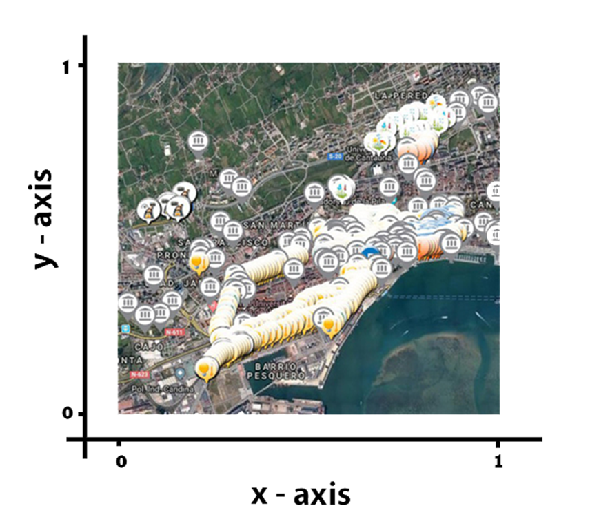

**IoT Network Dataset**

From this site, you can download the datasets used in our papers to construct the SIoT Network, which are based on real IoT objects available in the city of [Santander](http://www.smartsantander.eu/) and categorized following the typologies and data model for objects introduced in the [FIWARE Data Models](https://www.fiware.org/developers/data-models/).

##

**Citing the dataset**

If you use the dataset in a scientific publication, we would appreciate citations to the following paper:

**Marche, Claudio, et al. "How to exploit the Social Internet of Things: Query**

**Generation Model and Device Profiles' Dataset". Computer Networks (2020): 107248.**

Read on Elsevier ([link](https://www.sciencedirect.com/science/article/pii/S138912861931730X?via%3Dihub))

Thank you!

##

**Objects description**

The total number of objects comprehends a total of 16216 devices, of which 14600 from private users and 1616 from public services. Every object is described in the following form:

**id\_device id\_user device\_type device\_brand device\_model**

where:

**id\_device:** device ID;

**id\_user:** owner ID of the device (we indicate the municipality with 0);

**device\_type:** category associated (code) to the device; device\_type codes are explained in the public and private devices' sections;

**device\_brand:** brand of device, ranging from 1 to 12;

**device\_model:** model of device, ranging from 1 to 24.

##

**Objects profile**

For each object category (device\_type), the profile defines the set of possible services offered by each category as well as the possible applications that each object category is interested in, i.e. the possible set of applications an object could request. Objects' profiles are described in the following form:

**device\_type id\_off\_service id\_req\_application**

where:

**device\_type:** category associated (code) to the device;

**id\_off\_service:** list of offered service ID (from 1 to 18);

**id\_req\_application:** list of application ID (from 1 to 28).

The file "Services and Applications description" shows and describes a possible set of services and applications (with their respective ID) which are available in our Smart City scenario.

##

**Private devices**

Each user owns a certain number of devices, based on the ownership report of the [Global Web Index 2017](https://cdn2.hubspot.net/hubfs/304927/Downloads/Trends-17.pdf) calculated over 50000 users. The following table shows the devices used in the network and the probability that a user possesses each device.

| **Device** | **Mobility** | **Ownership (%)** | **Device\_type** |
| --- | --- | --- | --- |
| Smartphone | Mobile | 91 | 1 |
| Car | Mobile | 55 | 2 |
| Tablet | Mobile | 40 | 3 |
| Smart Fitness | Mobile | 22 | 4 |
| Smartwatch | Mobile | 5 | 5 |
| Pc | Static | 84 | 6 |
| Printer | Static | 53 | 7 |
| Home Sensors | Static | 15 | 8 |

Mobile devices are carried with the users during their movements, while static objects are left in the users' home. The number of private devices is 14600.

To simulate the users' movements, we rely on the mobility model called Small World in Motion ([SWIM](http://swim.di.uniroma1.it/)); the parameters used for this simulation are shown in the following table:

| **Number of users** | 4000 |
| --- | --- |
| **User perception radius** | 0.015 |
| **Simulation time** | 10 days |
| **α** | 0.9 |

Since SWIM only considers a unitary square as the area of interest, all the objects' positions are scaled down to this area.

The file _private\_static\_devices_ describes the static objects using the following form:

**id\_device x y**

where:

**id\_device:** device ID;

**x:** x coordinated of the device

**y:** y coordinated of the device

Each user (and his/her devices) alternates movement states and rest states. The file _private\_mobile\_devices_ describes the information about mobile objects and the coordinates of the user during the rest state, using the following form:

**timestamp\_start timestamp\_stop id\_user x y**

where:

**timestamp\_start:** timestamp of the beginning of the rest state;

**timestamp\_stop:** timestamp of the end of the rest state;

**id\_user:** user ID;

**x:** x coordinated of the user;

**y:** y coordinated of the user;

Naturally, mobile objects, of the same owner, have the same position of the user.

##

**Public devices**

The following table shows the public devices available in the city of Santander.

| **Data Model** | **Description** | **Device\_type** |
| --- | --- | --- |
| Point of Interest | Specific point location that a user may find useful or interesting. | 9 |
| Environment and Weather | Object responsible of the environmental and weather monitoring. | 10 |
| Transportation | Vehicles, taxis or buses. | 11 |
| Indicator | Digital signage to display information. | 12 |
| Garbage Truck | Collection and transport of waste products. | 13 |
| Street Light | Street lamp to illuminate roads in the city. | 14 |
| Parking | Location designed for parking. | 15 |
| Alarms | Security supervisor or traffic monitoring. | 16 |

These devices, which are all statics with the exception of the categories Transportation and Garbage Trucks.

The file _public\_static\_devices_ describes the static objects using the following form:

**id\_device x y**

where:

**id\_device:** device ID;

**x:** x coordinated of the device

**y:** y coordinated of the device

Each public mobile device alternates movement states and rest states. The file _public\_mobile\_devices_ describes the mobile objects and the coordinates of the device during the rest state using the following form during the whole simulation (10 days):

**timestamp\_start timestamp\_stop   id\_device x y**

where:

**timestamp\_start:** timestamp of the beginning of the rest state;

**timestamp\_stop:** timestamp of the end of the rest state;

**id\_device:** device ID;

**x:** x coordinated of the device

**y:** y coordinated of the device

##

**Adjacency Matrices**

According to notions of Social Internet of Things (SIoT), nodes establish social links and create social networks. We propose for each relationship and for SIoT network the adjacency matrix produced with our parameters. As follow, we depict relationships and their parameters:

- **OOR** _(Ownership Object Relationship)_ **:** type of relationship defined for objects owned by the same user. About public static devices, objects will create a relation only if they are in the communication range of each other. We use three different technologies: LoRa (around 1500 meters), Wi-Fi (around 400 meters) and Bluetooth (around 40 meters). Public mobile objects don't create this type of relation.
- **POR** _(Ownership Object Relationship)_ **:** relation created among objects in the same type, model and brand, only if their distance is greater than a two threshold: 2 or 2.5 km.
- **C-LOR** _(Co-Location Object Relationship)_ **:** if static devices (public or private) and private mobile take contact more than 13 times (number of meetings), can create a co-location relation.
- **SOR** _(Ownership Object Relationship)_ **:** this relationship is based on three parameters, that are the number of meetings (N = 3), the meeting duration (TM = 30 minutes) and the interval between two consecutive meetings (TI = 6 hours). The relation is created between private mobile devices.
- **SOR**** 2**_(Ownership Object Relationship)_**:** a variant of the SOR called SOR2 is created to connect the public mobile devices. In particular the relation is between public mobile devices and users' mobile objects. The parameters, as in the SOR, is set as follow: N = 3, TM = 1 minute and TI = 1 hour.
- **SIoT:** completely SIoT network is created with the combination of all relationships (all relations with an operation of disjunction OR).

##

**Lysis Dataset**

These data are obtained by the Lysis platform: a collection of more than 11000 queries from 154 devices over a period of 7 months, from April 2017 to October 2017.

The network is composed of two types of nodes: smartphones and Raspberry boards; based on the typology, the devices can require up to five different applications.

The following table shows the applications available.

| **Application** | **Name** | **Description** |
| --- | --- | --- |
| 1 | Battery Level | The App monitors the condition and the level of the battery and helps to configure the device settings in order to maximize the battery level. The App can be installed by smartphone devices. |
| 2 | Data Viewer | Smartphone and Raspberry devices display data in graphs and other charts. The application offers API to forward data and a simple view to display these. |
| 3 | OBD Car | Using the OBD data from the user's car the smartphone offers the opportunity to know the state of the vehicle. |
| 4 | Be Right Beach | The application provides information about the beaches (as temperature and the water PH) and the occupation level. Smartphones and Raspberry devices can use the application. |
| 5 | Nautical Data | The application, for Smartphone and Raspberry, provides nautical charts for cruising and sailing. The data consist of sea and weather conditions. |

For each application, a CSV file uses the following form:

**POSIX source app x\_x0 y\_y0 t\_t0**

where:

**POSIX:** time of the request expressed using the POSIX time;

**source:** source device for the request. That can be a Smartphone (from 1 to 127) or a Raspberry (from 128 to 154);

**app:** number of the application;

**x\_x0:** x normalized distance with respect to the node x position. The distance takes value from -1 to 1;

**y\_x0:** y normalized distance with respect to the node y position. The distance takes value from -1 to 1;

**t\_y0:** difference between the day in the request and the day of the request. E.g real-time requests take a value of 0, while requests about data of 7 days back take a value of 7.

**Contacts**

**Michele Nitti**

Email: michele.nitti@unica.it

WebSite: [link](https://sites.unica.it/net4u/michele-nitti/)

**Claudio Marche**

Email: claudio.marche@unica.it

Website: [link](https://sites.unica.it/net4u/claudio-marche/)

**Luigi Atzori**

Email: l.atzori@unica.it

WebSite: [link](https://sites.unica.it/net4u/luigi-atzori/)